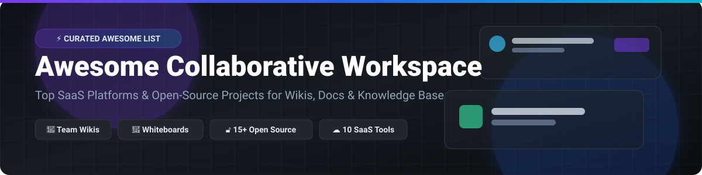

# ⚡ Awesome Collaborative Workspace 🚀

  
  
  
  
  

---

## 📌 Overview

**Curated List of SaaS Platforms & Open-Source GitHub Projects for Collaborative Workspaces 🛠️**

*Focused on Team Wikis, Collaborative Docs, Digital Whiteboards & Enterprise Knowledge Management.*

**Last updated: October 2026 📅**

Welcome to **Awesome Collaborative Workspace**! This repository tracks notable **SaaS platforms** and production-grade **open-source projects** designed for real-time collaboration. These tools empower remote and hybrid teams to co-create documents, build structured knowledge bases, and seamlessly coordinate projects in shared digital environments.

---

## 📖 Table of Contents

- [☁️ SaaS/Hosted Platforms](#-saashosted-platforms)
- [🔓 Open-Source GitHub Projects](#-open-source-github-projects)
- [🤝 How to Contribute](#-how-to-contribute)
- [☕ Support & Sponsorship](#-support--sponsorship)
- [📊 Star History](#-star-history)
- [⚠️ Disclaimer](#-disclaimer)

---

## ☁️ SaaS/Hosted Platforms

> **📊 Market Context & Industry Dynamics**: The global collaborative workspace market is valued at **~$15 Billion in 2026** and is projected to expand to **~$40 Billion by 2032** at an estimated **~18% CAGR**. 
> 
> The sector is **moderately fragmented** — no single vendor holds a winner-take-all monopoly. Market leaders such as **Notion** prioritize flexible database-driven canvases with a free tier up to **1,000 blocks** . **Coda** innovates with a **Maker billing model** where doc editors and viewers are **entirely free** . Enterprise behemoths like **Confluence** offer dedicated tier structures starting at **$6.70/user/month** alongside a **10-user free plan** . Meanwhile, products like **Roam Research** operate strictly on a subscription model (**$15/month** after a **31-day trial**). Teams select platforms based on ecosystem synergy, data governance, and pricing alignment rather than feature duplication.

The following table is sorted by **Company Size / Valuation / Revenue** in descending order:

| Platform | Description | Pricing (Starting Paid Tier) | Free Tier / Trial Limits | Company Size / Revenue / Valuation 📈 |
| :--- | :--- | :--- | :--- | :--- |
| **[Microsoft Loop](https://www.microsoft.com/en-us/microsoft-loop)** 🏢 | **Microsoft's collaborative canvas with portable components.** Syncs in real time across Teams, Outlook, Word, and Whiteboard. | **$6.00/user/month** (Microsoft 365 Business Basic starting bundle) | **Free in preview** for personal Microsoft account holders (OneDrive/SharePoint bounds) | **~$281 Billion Revenue** (Microsoft FY2025 parent) |
| **[Notion](https://www.notion.so/)** 📑 | **The category-defining all-in-one workspace.** Combines docs, wikis, databases, and project management in one canvas. | **$12.00/user/month** (Plus, annual) or **$15.00/month** (monthly) | **Free**: **1,000 content blocks**, **10 guests**, **5 MB file upload limit**, **7-day page history** | **~$10 Billion Valuation** (Private) |
| **[Confluence](https://www.atlassian.com/software/confluence)** 🌐 | **Atlassian's enterprise wiki & documentation hub.** Deeply integrated with Jira and the Atlassian Cloud suite. | **$6.70/user/month** (Standard, 1–100 users) | **Free forever for 10 users**, **2 GB storage**, Community Support | **~$4 Billion Revenue** (Atlassian FY2025) |
| **[Roam Research](https://roamresearch.com/)** 🧠 | **Graph-based note-taking for networked thinking.** Bidirectional linking and block-level citations. | **$15.00/month** (Pro) or **$165.00/year** | **No permanent free plan** (Offers **31-day free trial** full access) | **~$200 Million Valuation** (Private est.) |
| **[Basecamp](https://basecamp.com/)** ⛺ | **The project management & team chat pioneer.** Flat-rate pricing with no per-user fees on paid studio plans. | **$25.00/month** (Freelancer, up to 10 users) or **$59.00/month** (Studio) | **Free**: **1 project**, **5 users**, **1 GB file storage**, private Pings | **~$100 Million Revenue** (Private est.) |
| **[Craft](https://www.craft.do/)** 🎨 | **Structured document editor with local-first storage and AI.** Native apps for Mac, iPad, iPhone, and Web. | **$8.00/month** (Plus) or **$15.00/month** (Family/Team) | **Starter (Free)**: **1,500 content blocks**, **1 GB storage**, **25 MB file limit**, **7-day history** | **~$50 Million Raised** (Private est.) |
| **[Anytype](https://anytype.io/)** 🔐 | **Local-first, peer-to-peer encrypted workspace.** Self-host data for free or use encrypted sync nodes. | **$99.00/year** (Local-First Pro Node backup storage) | **Free forever with self-hosting** (**1 GB free backup storage** on Anytype nodes) | **~$20 Million Raised** (Private est.) |
| **[Nuclino](https://www.nuclino.com/)** ⚡ | **Lightweight, ultra-fast collaborative wiki and knowledge base.** Features visual graph view for connected notes. | **$4.50/user/month** (Starter, annual) or **$6.00/user/month** (monthly) | **Free**: **Up to 50 items**, **2 GB total storage**, collaborative wikis & REST API | **~$10 Million Raised** (Private est.) |
| **[Coda](https://coda.io/)** 📊 | **All-in-one interactive doc platform with Maker billing.** Only pay for Doc Makers; Editors/Viewers are free. | **$12.00/Doc Maker/month** (Pro, annual) or **$15.00/month** | **Free**: Unlimited Doc Makers, limited features, unlimited doc sharing, size caps on personal docs | **Acquired by Superhuman** (Private) |
| **[Slite](https://slite.com/)** 💡 | **AI-powered knowledge base for remote and async teams.** Structured documentation & smart search. | **$8.00/user/month** (Standard, annual) or **$10.00/month** | **14-day free trial** on Standard plan (**No permanent free tier**) | **Acquired by Superhuman** (Private) |

---

## 🔓 Open-Source GitHub Projects

The open-source collaborative workspace ecosystem is **exceptionally mature, privacy-focused, and feature-rich**. These solutions offer full self-hosting capabilities, local-first data storage, and zero vendor lock-in.

Sorted by **GitHub Star Count** in descending order:

| Project | Description | Stars 🌟 |
| :--- | :--- | :--- |
| **[Excalidraw](https://github.com/excalidraw/excalidraw)** 🎨 | **Virtual hand-drawn style collaborative whiteboard.** End-to-end encrypted infinite canvas, shape libraries, SVG/PNG export, local-first autosave. |  |
| **[AppFlowy](https://github.com/AppFlowy-IO/AppFlowy)** 🚀 | **The leading open-source Notion alternative.** AI collaborative workspace with docs, wikis, grids, kanban boards, and databases. AGPLv3. |  |
| **[AFFiNE](https://github.com/toeverything/AFFiNE)** 🌌 | **Next-gen knowledge base merging docs, whiteboards, and databases.** Local-first, offline-first, privacy-focused replacement for Notion & Miro. MIT. |  |
| **[Joplin](https://github.com/laurent22/joplin)** 📱 | **Privacy-focused note-taking & sync app.** Cross-platform Markdown editor with E2EE, web clipper, and multi-device cloud synchronization. |  |
| **[Logseq](https://github.com/logseq/logseq)** 📖 | **Privacy-first, open knowledge management and collaboration platform.** Outliner with Markdown/Org-mode, PDF annotation, and graph view. |  |
| **[TriliumNext](https://github.com/TriliumNext/Trilium)** 🌲 | **Hierarchical personal & team knowledge base.** Note versioning, mind maps, Excalidraw integration, REST API, scaling to 100k+ notes. |  |
| **[SiYuan](https://github.com/siyuan-note/siyuan)** 🧩 | **Privacy-first local-first personal knowledge management system.** Block-level references, Markdown WYSIWYG, LAN peer sync, and database views. |  |
| **[Etherpad](https://github.com/ether/etherpad-lite)** ✍️ | **Real-time collaborative text editor.** Highly customizable open-source editor powered by Node.js with thousands of active plugins. |  |
| **[Outline](https://github.com/outline/outline)** 📑 | **Fast, collaborative team knowledge base built for modern teams.** Beautiful UI, Markdown support, Real-time edits, Slack & Figma integrations. |  |
| **[Huly](https://github.com/hcengineering/platform)** 💼 | **All-in-one project management & workspace platform.** Open-source alternative to Linear, Jira, Slack, and Notion with Chat, CRM & HRM. |  |
| **[Docmost](https://github.com/docmost/docmost)** 📚 | **Open-source Confluence & Notion alternative.** Real-time collaboration, page history, diagramming (Draw.io, Excalidraw, Mermaid), AGPLv3. |  |
| **[Hedgedoc](https://github.com/hedgedoc/hedgedoc)** 📝 | **Real-time collaborative Markdown editor.** Formerly CodiMD. Allows writing and sharing markdown documents live with zero setup. |  |
| **[Focalboard](https://github.com/mattermost/focalboard)** 📋 | **Open-source multilingual Notion and Trello alternative.** Project management tool by Mattermost for task tracking across teams. |  |
| **[Wiki.js](https://github.com/requarks/wiki)** 🌐 | **The most powerful and extensible open-source Wiki software.** Node.js based, Git sync, Markdown/WYSIWYG/HTML editors, multi-lingual. |  |
| **[Planka](https://github.com/plankanban/planka)** 📌 | **Elegant open-source kanban board for workgroups.** Built with React and Redux, real-time updates, user mention notifications, attachments. |  |

---

## 🤝 How to Contribute

Contributions make the open-source community an amazing place to learn, inspire, and create! 🌟

1. **Fork the Repository** 🍴
2. **Add/Update Entries** in `README.md` (Ensure consistent markdown table formatting).
3. **Include Key Details**: Name, official URL, concise description, precise pricing/free tier details or repository star badge.
4. **Submit a Pull Request** 🚀 with a brief description of additions.

Refer to [Awesome-Awesome-Awesome](https://github.com/ishandutta2007/Awesome-Awesome-Awesome) for list standards and guidelines!

---

## ☕ Support & Sponsorship

If you found this curated list helpful, please consider supporting the project! Your encouragement keeps this list updated and maintained. ❤️

- ⭐ **Star this repository** on GitHub
- 🔄 **Fork & Share** with your team or community
- ☕ **Buy Me a Coffee / Sponsor**: Support ongoing maintenance on the [GitHub Sponsor Dashboard](https://github.com/sponsors/ishandutta2007)!

---

## 📊 Star History

---

## ⚠️ Disclaimer

- This is a **community-curated index** for informational and educational purposes — not an official endorsement.
- Enterprise data handling: Always evaluate compliance (SOC2, GDPR, HIPAA) before deploying workspace platforms for sensitive data.
- **Open-Source vs SaaS**: Open-source solutions like **AppFlowy**, **AFFiNE**, and **Outline** offer complete data sovereignty and self-hosting flexibility, whereas commercial SaaS platforms (Notion, Microsoft Loop, Confluence) provide fully managed infrastructure and turn-key enterprise integrations.
- **Pricing & Tier Accuracy**: Pricing information is verified as of October 2026. Vendor tiers are subject to change over time.

---

**Made with ❤️ for product managers, software engineers, technical leads, and open-source enthusiasts.**
